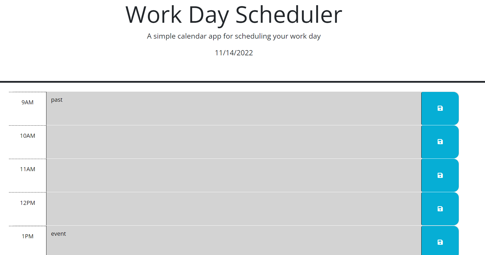

# Work Day Scheduler

## Description

This work day scheduler displays the current date and hours of a typical work day. Past events are shown in gray, present events are red, and future events are green. Keep track of events in each time block to stay organized throughout the day!

## Usage

Users may visit the webpage at [https://elliewalsch.github.io/work-day-scheduler/](https://elliewalsch.github.io/work-day-scheduler/).

Type an event into the respective hour, then click the blue icon to save the event and prevent it from disappearing upon refresh.  

## Credits

- [Day.js docs](https://day.js.org/)
- [jQuery API documentation](https://api.jquery.com/)
- Starter code provided by Washington University Full Stack Bootcamp